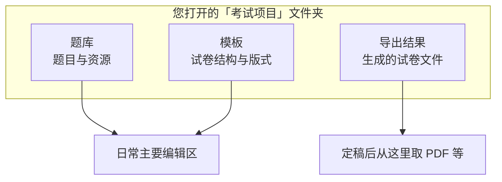
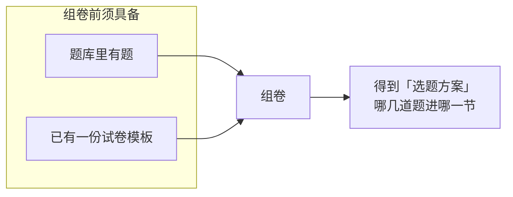
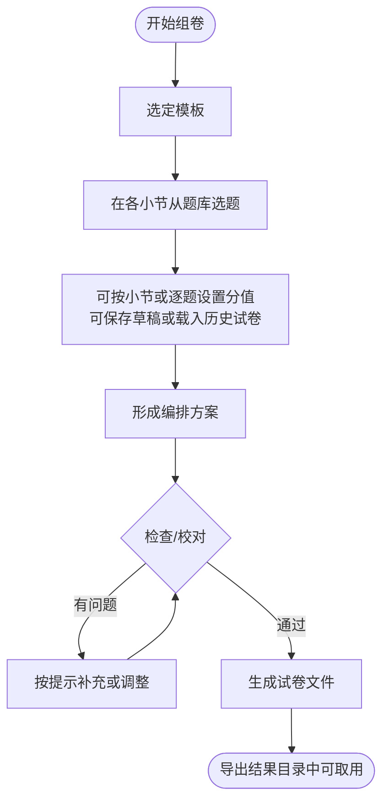
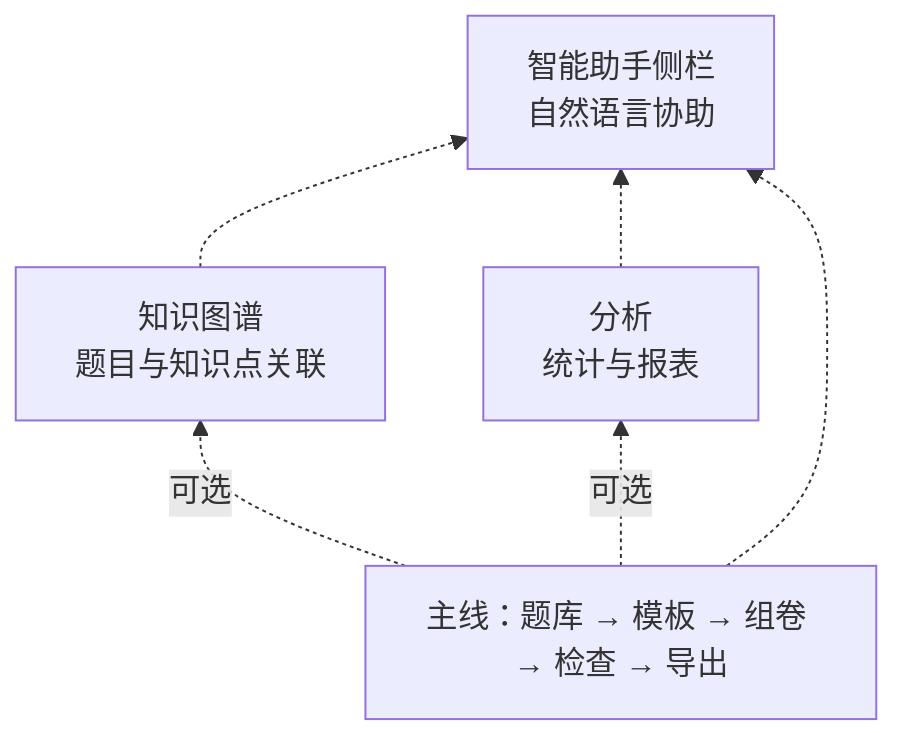

# 组卷系统如何运作（概念说明）

下面用**流程图**说明「考试项目、题库、模板、组卷与导出」的关系。具体操作仍请在「组卷」「题库」「模板」等界面完成；本文**不是**逐步点击教程。

---

## 考试项目里有什么

---

## 题库、模板与组卷：谁依赖谁

没有题目，组卷没有内容；没有模板，就没有「这一场考」的章节与版式骨架。

---

## 从选题到拿到试卷：主流程

「检查」会核对模板要求、题目是否存在、资源是否齐全等；**通过后再导出**，可减少白跑一趟。

---

## 与知识图谱、分析、智能助手的关系（可选）

图谱、分析与智能助手**不改变**上述主线顺序；助手可在各业务页叠加使用，便于整理题目、维护图谱或触发分析等操作。
