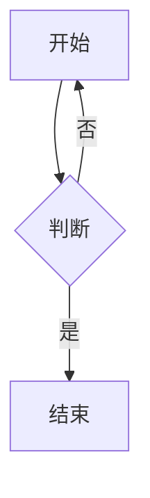

# Mermaid 流程图：在题目里怎么用

在**题干、解析或题组材料**中，您可以用 **Mermaid** 画出流程图（方框、菱形判断、箭头等）。写法与 PrimeBrush 教育绘图类似：用**代码围栏**包住一段**流程图描述**即可。

---

## 怎么写进题目

1. 在正文需要插图的位置，使用**三反引号**，第一行写 **`mermaid`**（小写）。
2. 下一行起写流程图规则（常用从 `flowchart TD` 或 `flowchart LR` 开始）。
3. 最后用**三反引号**结束。

**示例：**

````markdown
流程如下：


````

- **和教育绘图插图**：同一道题里可以同时有 `` ```primebrush `` 与 `` ```mermaid ``，**按您写的顺序**依次生成。
- **题目列表**：列表摘要里流程图会显示为「流程图」类提示，点进题目可看完整图。

更多语法可参考 [Mermaid 官方说明](https://mermaid.js.org/)（可选）。

---

## 在软件里编辑（题库页面）

打开**题库**，编辑某道题时，可使用 **「Mermaid / 流程图」** 相关入口（以界面按钮名称为准）：

- **直接打字**：在文本框里写或改 Mermaid 源码，一侧可看到**预览**。
- **简单流程图画布**：在 **自上而下（TD）或从左到右（LR）** 的简单流程图里，可以**拖节点、连线、改文字**；复杂图形请以文本为准，在文本框里手写。
- **右侧预览**：编辑题干/解析时，页面上的预览会尽量与当前内容一致；保存后插图会写入本题所在题集的 **`image/`** 目录。

---

## 导出成试卷（PDF）时

- 网页里能看到的流程图，导出时一般会转为适合印刷的尺寸。若导出失败或图不完整，多与**本机导出环境是否齐全**有关，请联系学校或管理员的**技术支持**处理；一般教师无需自行安装命令行工具。
- **中文显示**：若试卷里中文缺字，可请管理员检查系统是否装有常用中文字体；个人用户也可先确认操作系统字体完整。
- **图太大或太小**：试卷上流程图的大小由**试卷模板**里的版式设置控制，需在「模板」相关功能中调整（与题目正文里的围栏配合使用）。

---

## 常见问题

| 现象 | 建议 |
|------|------|
| 预览正常，PDF 里没有图 | 向管理员反馈，确认导出环境；勿自行猜测安装各类开发工具。 |
| 画布和文字不一致 | 复杂流程图请以**文本框里的源码**为准，在文本中修改。 |
| 想和几何图一起用 | 可与 PrimeBrush 混用，见 [PrimeBrush 教育绘图](./primebrush.md)。 |
