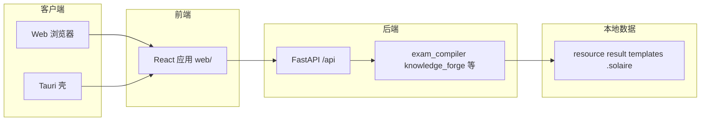

# 架构总览（SolEdu）

## 产品定位

**SolEdu**：K12 教育自动化平台（组卷、题库、知识图谱、学情分析、教育绘图、智能助手）。社区版 AGPL-3.0；支持 Web 与 Windows 桌面（Tauri）。

## 技术栈

- **后端**：Python + FastAPI（Uvicorn）
- **前端**：React + TypeScript + Vite + Tailwind
- **桌面**：Rust + Tauri（`src-tauri/`），可嵌入 Python 运行时供本地后端
- **数据**：项目目录内文件，常见路径包括 `resource/`、`result/`、`templates/`、`.solaire/` 等（以代码与文档为准）

## 分层关系（简图）

## 工程边界（约定）

- **业务规则**以 `exam_compiler` 等核心 Python 包为准；Web 层负责编排与交互。
- **HTTP API** 统一前缀 `/api/*`；错误体常见形式为 `{"detail":"..."}`。
- **帮助文档**从 `src/solaire_doc/` 读取并发布，与 `wiki/` 职责不同。

## 开发模式（概念）

本地开发常用 `pixi run dev`：串联后端（如 `127.0.0.1:8000`）、Vite（如 `localhost:5173`）与 Tauri；细节见根目录 `README.md` 与 [runbooks/build-test.md](../runbooks/build-test.md)。
